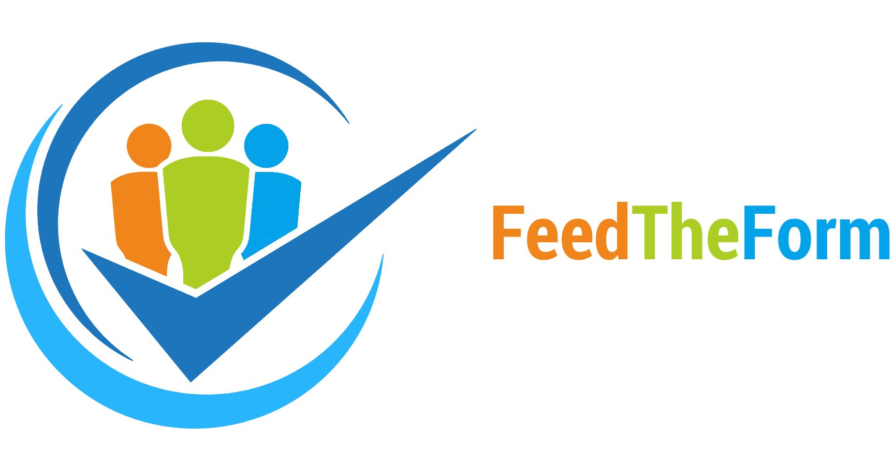

# FeedTheForm

## Vision

An app that will allow attendees to rate lectures, while motivating them to do so by placing the most active raters in a competition to win prizes. The given feedback will be used to attribute ratings to the lectures.

## User stories

- As a user, I want to be able to attribute a rating to a talk and to the speaker who gave it, so that my opinion is taken into account when considering the renewal of this lecture for next year.

- As a user, I want to be able to check all the information about each lecture, so that I can decide if a lecture interests me and when it'll take place.

- As an admin, I want to be able to check the rating of each lecture and each speaker, so that I can decide which lectures will be renewed for next year.

- As a user, I want to be notified if I’ve won a prize so that I can go collect it on time.

- As an admin, I want the app to guarantee that each rating was given by a user that was present in the lecture so that the ratings are valid.

- As a user, I want to be able to check my account settings so that I can update or delete my information.
