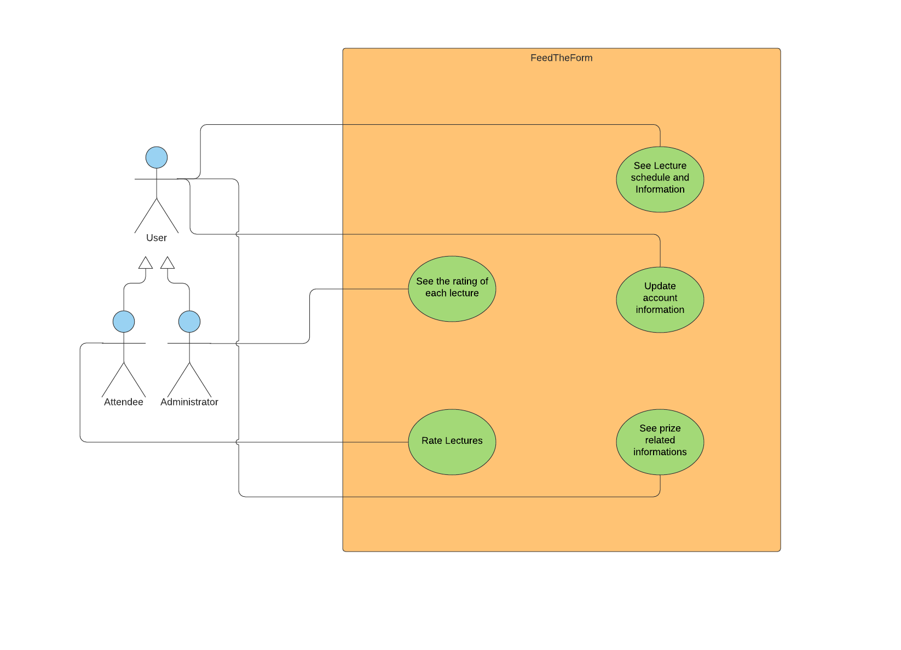
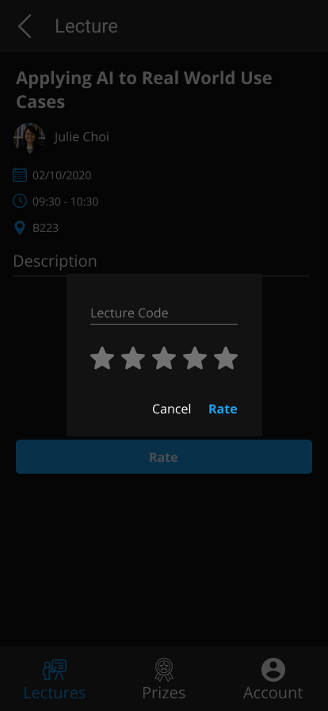
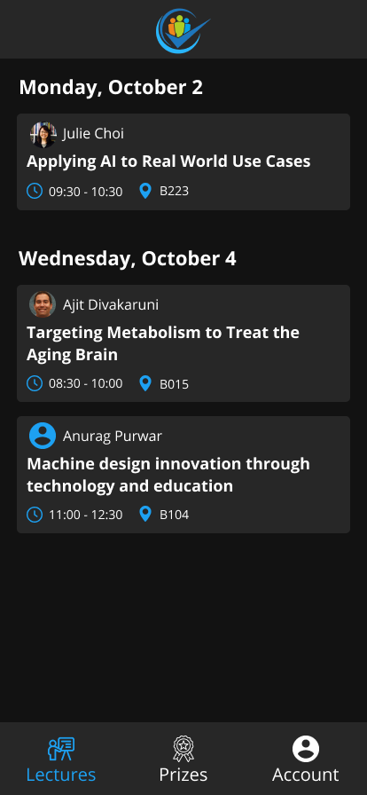
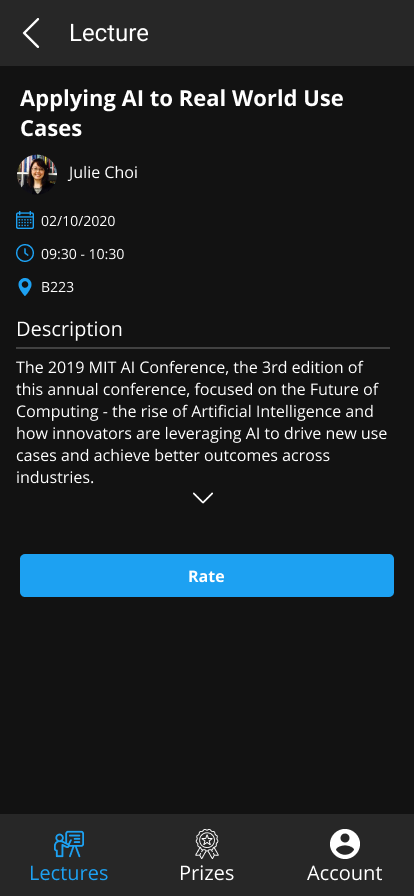
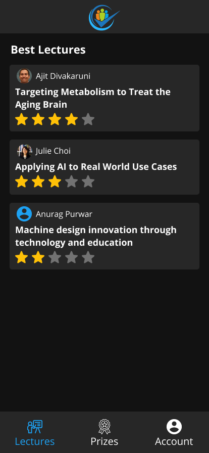
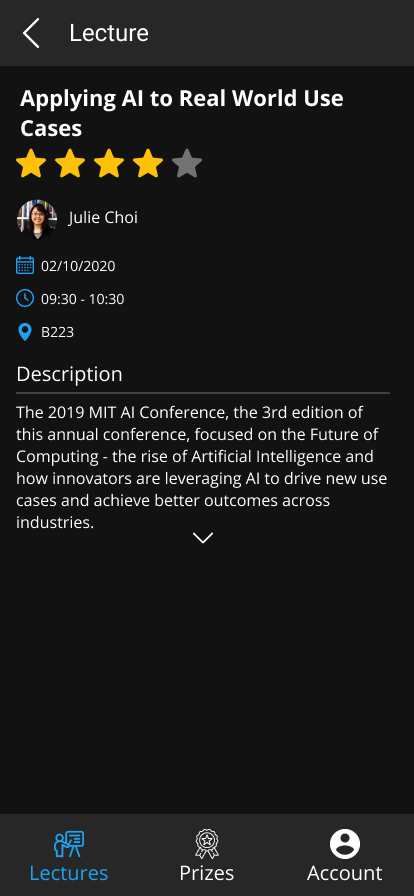
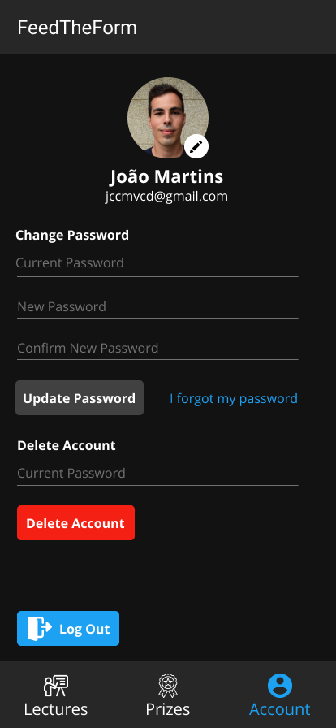
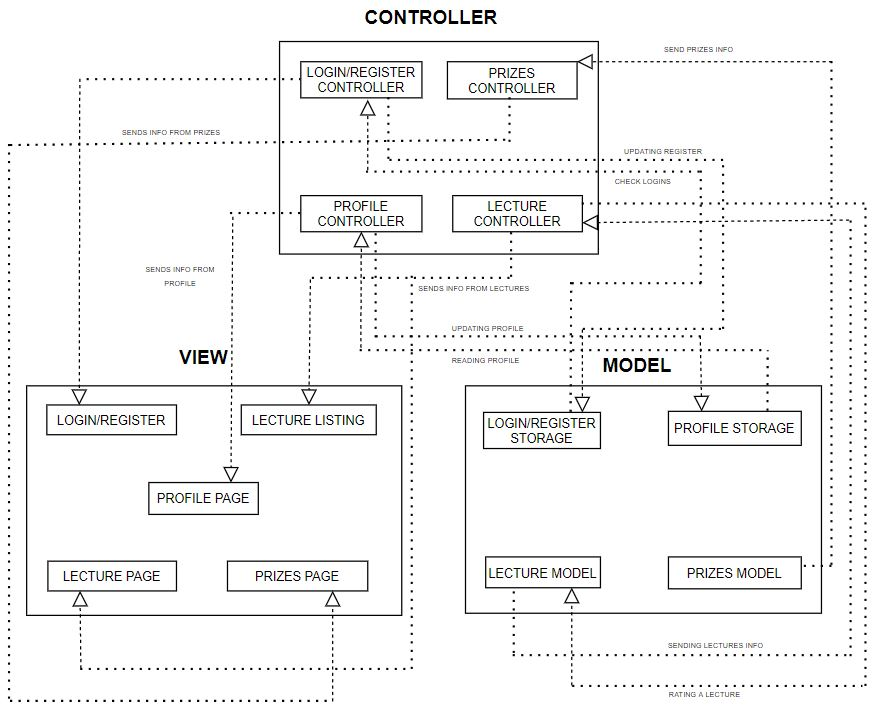
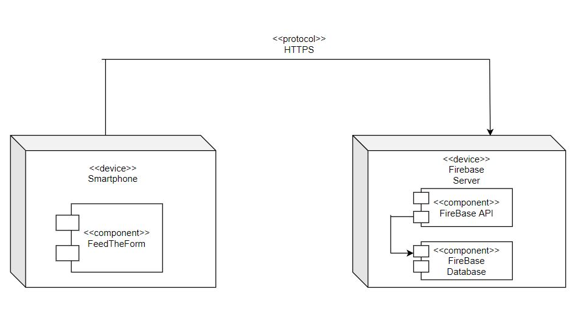

# openCX-*esofantasticos* Development Report

Welcome to the documentation pages of the *FeedTheForm* of **openCX**!

You can find here detailed about the (sub)product, hereby mentioned as module, from a high-level vision to low-level implementation decisions, a kind of Software Development Report (see [template](https://github.com/softeng-feup/open-cx/blob/master/docs/templates/Development-Report.md)), organized by discipline (as of RUP): 

* Business modeling 
  * [Product Vision](#Product-Vision)
  * [Elevator Pitch](#Elevator-Pitch)
* Requirements
  * [Use Case Diagram](#Use-case-diagram)
  * [User stories](#User-stories)
  * [Domain model](#Domain-model)
* Architecture and Design
  * [Logical architecture](#Logical-architecture)
  * [Physical architecture](#Physical-architecture)
  * [Prototype](#Prototype)
* [Implementation](#Implementation)
* [Test](#Test)
* [Configuration and change management](#Configuration-and-change-management)
* [Project management](#Project-management)

So far, contributions are exclusively made by the initial team, but we hope to open them to the community, in all areas and topics: requirements, technologies, development, experimentation, testing, etc.

Please contact us! 

Thank you!

*João Gonçalves, João Martins, João Martins, José Rodrigues e Ricardo Marques*

---

## Product Vision
An app that will allow attendees to rate lectures, while motivating them to do so by placing the most active raters in a competition to win prizes. The given feedback will be used to attribute ratings to the lectures.

---
## Elevator Pitch
Our goal is to have an application that helps organizations of conferences get feedback on lectures. Each person who attended the lecture is allowed to rate it and for every rating given, they eligble contenders to win a prize in draw among raters.

---
## Requirements

In this section, you should describe all kinds of requirements for your module: functional and non-functional requirements.

Start by contextualizing your module, describing the main concepts, terms, roles, scope and boundaries of the application domain addressed by the project.

### Use case diagram



### User stories

#### Story #1

As a user, I want to be able to attribute a rating to a talk and to the speaker who gave it, so that my opinion is taken into account when considering the renewal of this lecture for next year.

##### User interface mockup



##### Acceptance tests
```gherkin
Scenario: Rating a lecture
  Given Lecture A can be rated from 1 to 5 stars
  When I tap the "add rating" button
  And I submit a rating of 5 stars
  Then Lecture A has my rating of 5 stars
```

##### Value and effort

Value: Must Have
Effort: XL

#### Story #2 

As a user, I want to be able to check all the information about each lecture, so that I can decide if a lecture interests me and when it'll take place.

##### User interface mockup

  

##### Acceptance tests
```gherkin
  Scenario: Deciding whether to attend a lecture
  Given Lecture A has its information
  When I see the lecture A’s information
  Then It affects my decision to choose if I want to attend it or not.
```

##### Value and effort

Value: Should Have
Effort: M

#### Story #3

As an admin, I want to be able to check the rating of each lecture and each speaker, so that I can decide which lectures will be renewed for next year.

##### User interface mockup

  

##### Acceptance tests
```gherkin
  Scenario: Deciding whether to repeat a lecture next year
  Given Lecture A has its rating
  When I see the lecture A’s rating
  Then It affects my decision to choose if I want to repeat it or not.
```

##### Value and effort

Value: Must Have
Effort: XL

#### Story #4

As a user, I want to be notified if I’ve won a prize so that I can go collect it on time.

##### User interface mockup


##### Acceptance tests
```gherkin
  Scenario: Knowing if I won any of the available prizes
  Given I am eligible to won any of the prizes
  When I rate a lecture that I attended to
  And I receive a message in the app
  Then I know what prize I've won and how I can collect it
```

##### Value and effort

Value: Must Have
Effort: M

#### Story #5

As an admin, I want the app to guarantee that each rating was given by a user that was present in the lecture so that the ratings are valid.

##### User interface mockup


##### Acceptance tests
```gherkin
  Scenario: Guarantee that users rate only the lectures that they attended to
  Given The app will ask for a code
  When I want to rate a lecture
  And I insert the correct code, given during that lecture
  Then I can rate the lecture
```

##### Value and effort

Value: Should Have
Effort: M

#### Story #6

As a user, I want to be able to check my account settings so that I can update or delete my information.

##### User interface mockup



##### Acceptance tests
```gherkin
  Scenario: Changing my account information
  Given I go to my account settings
  When I want to change any of my account information, as well as deleting my account
  Then My account is updated
```

##### Value and effort

Value: Could Have
Effort: M

### Domain model

To better understand the context of the software system, it is very useful to have a simple UML class diagram with all the key concepts (names, attributes) and relationships involved of the problem domain addressed by your module.

---

## Architecture and Design
The architecture of a software system encompasses the set of key decisions about its overall organization.

A well written architecture document is brief but reduces the amount of time it takes new programmers to a project to understand the code to feel able to make modifications and enhancements.

To document the architecture requires describing the decomposition of the system in their parts (high-level components) and the key behaviors and collaborations between them.

In this section you should start by briefly describing the overall components of the project and their interrelations. You should also describe how you solved typical problems you may have encountered, pointing to well-known architectural and design patterns, if applicable.

### Logical architecture


### Physical architecture


### Prototype
To help on validating all the architectural, design and technological decisions made, we usually implement a vertical prototype, a thin vertical slice of the system.

In this subsection please describe in more detail which, and how, user(s) story(ies) were implemented.

---

## Implementation
Regular product increments are a good practice of product management. 

While not necessary, sometimes it might be useful to explain a few aspects of the code that have the greatest potential to confuse software engineers about how it works. Since the code should speak by itself, try to keep this section as short and simple as possible.

Use cross-links to the code repository and only embed real fragments of code when strictly needed, since they tend to become outdated very soon.

---
## Test

There are several ways of documenting testing activities, and quality assurance in general, being the most common: a strategy, a plan, test case specifications, and test checklists.

In this section it is only expected to include the following:
* test plan describing the list of features to be tested and the testing methods and tools;
* test case specifications to verify the functionalities, using unit tests and acceptance tests.
 
A good practice is to simplify this, avoiding repetitions, and automating the testing actions as much as possible.

---
## Configuration and change management

Configuration and change management are key activities to control change to, and maintain the integrity of, a project’s artifacts (code, models, documents).

For the purpose of ESOF, we will use a very simple approach, just to manage feature requests, bug fixes, and improvements, using GitHub issues and following the [GitHub flow](https://guides.github.com/introduction/flow/).


---

## Project management

To plan and manage our project we used the project management tool "Trello": https://trello.com/b/PoEzOOrw/feedtheform


---

## Evolution - contributions to open-cx

Describe your contribution to open-cx (iteration 5), linking to the appropriate pull requests, issues, documentation.
