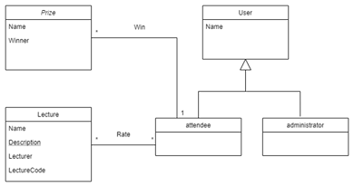

# openCX-_esofantasticos_ Development Report

Welcome to the documentation pages of the _FeedTheForm_ of **openCX**!

You can find here detailed about the (sub)product, hereby mentioned as module, from a high-level vision to low-level implementation decisions, a kind of Software Development Report (see [template](https://github.com/softeng-feup/open-cx/blob/master/docs/templates/Development-Report.md)), organized by discipline (as of RUP):

- Business modeling
  - [Product Vision](#Product-Vision)
  - [Elevator Pitch](#Elevator-Pitch)
- Requirements
  - [Use Case Diagram](#Use-case-diagram)
  - [User stories](#User-stories)
  - [Domain model](#Domain-model)
- Architecture and Design
  - [Logical architecture](#Logical-architecture)
  - [Physical architecture](#Physical-architecture)
  - [Prototype](#Prototype)
- [Implementation](#Implementation)
- [Test](#Test)
- [Configuration and change management](#Configuration-and-change-management)
- [Project management](#Project-management)

So far, contributions are exclusively made by the initial team, but we hope to open them to the community, in all areas and topics: requirements, technologies, development, experimentation, testing, etc.

Please contact us!

Thank you!

_João Gonçalves, João Martins, João Martins, José Rodrigues e Ricardo Marques_

---

## Product Vision

An app that will allow attendees to rate lectures, while motivating them to do so by placing the most active raters in a competition to win prizes. The given feedback will be used to attribute ratings to the lectures.

---

## Elevator Pitch

Most lectures in conferences greatly appreciate feedback to improve themselves and to let conference organizers evaluate better which lectures work best, but when lectures finish, attendees usually don't bother leaving ratings and just go on with their lives.
We created **FeedTheForm** to solve this problem, by not only giving the necessary platform to allow those ratings to be given organically, but also to motivate attendees to rate the lectures they attend by organizing draws with prizes to be won.

---

## Requirements

In this section, you should describe all kinds of requirements for your module: functional and non-functional requirements.

Start by contextualizing your module, describing the main concepts, terms, roles, scope and boundaries of the application domain addressed by the project.

### Use case diagram


#### See Lecture schedule and Information:

*  **Actor**. User.

*  **Description**. This use case exists so that the User can have access to Lectures schedule and information.

*  **Preconditions and Postconditions**.  In order to see this information, the User must first register and Log-in.
  
*  **Normal Flow**. 
	1. The User presses the button to go to the Lectures page.
	2. The User choses one of the Lectures and sees more information regarding that lecture.
	
#### See prize related informations:

*  **Actor**. User.

*  **Description**. This use case exists so that the User can have access to prize related information.

*  **Preconditions and Postconditions**.  In order to see this information, the User must first register and Log-in.
  
*  **Normal Flow**. 
	1. The User presses the button to go to the prizes page.
	2. The User choses one of the prizes and sees more information regarding that prize.

#### Rate Lectures:

*  **Actor**. Attendee.

*  **Description**. This use case exists so that Attendees can rate lectures and help improve the quality of the event.

*  **Preconditions and Postconditions**.  In order to rate a lecture, the attende must first insert the code given in the lecture for this effect.
  
*  **Normal Flow**. 
	1. The attendee presses the button to rate the lecture.
	2. The attendee types the code given in the lecture.
	3. The attendee rates the lecture from 1-5 stars.

*  **Alternative Flows and Exceptions**. 
	1. The attendee presses the button to rate the lecture.
	2. The attendee types the wrong code.
	3. The attendee can not rate the lecture and is asked to input the code given in the lecture.
	
#### See the rating of each lectures:

*  **Actor**. Administrator.

*  **Description**. This use case exists so that Administrators can see the average rating given to each lecture and improve the quality of the event based on the feedback given by the attendees.

*  **Preconditions and Postconditions**.  In order to see the average rating given to each lecture the user must be logged in as an Administrator.
  
*  **Normal Flow**. 
	1. The Administrator presses the button to go to the Lectures page.
	2. The Administrator choses one of the Lectures and sees the average rating given to that lecture as well as other information regarding the lecture.

#### Update account information:

*  **Actor**. User.

*  **Description**. This use case exists so that Users can update their account information, such as password and profile photo.

*  **Preconditions and Postconditions**.  In order to update information the User has to be logged in.
  
*  **Normal Flow**. 
	1. The User presses the button to go to the Account page.
	2. The User types the current password as well as the new one he wants to update to.
	3. The User presses the update Password button and if the Password is correct and the New Password is equal to the confirmation the Password is updated.

*  **Alternative Flows and Exceptions**. 
	1. The User presses the button to go to the Account page.
	2. The User types the current password as well as the new one he wants to update to.
	3. The User presses the update Password button and if the Password is not the correct or the New Password is not equal to the confirmation the Password is not updated.
	4. The User can then re-type the information and proceed as normal 
*  **OR** 
	1. The User presses the button to go to the Account page.
	2. The User choses a new profile picture.
	3. The profile picture is updated.
  
### User stories

#### Story #1

As a user, I want to be able to attribute a rating to a talk and to the speaker who gave it, so that my opinion is taken into account when considering the renewal of this lecture for next year.

##### User interface mockup


##### Acceptance tests

```gherkin
Scenario: Rating a lecture
  Given Lecture A can be rated from 1 to 5 stars
  When I tap the "add rating" button
  And I submit a rating of 5 stars
  Then Lecture A has my rating of 5 stars
```

##### Value and effort

Value: Must Have
Effort: XL

#### Story #2

As a user, I want to be able to check all the information about each lecture, so that I can decide if a lecture interests me and when it'll take place.

##### User interface mockup

 

##### Acceptance tests

```gherkin
  Scenario: Deciding whether to attend a lecture
  Given Lecture A has its information
  When I see the lecture A’s information
  Then It affects my decision to choose if I want to attend it or not.
```

##### Value and effort

Value: Should Have
Effort: M

#### Story #3

As an admin, I want to be able to check the rating of each lecture and each speaker, so that I can decide which lectures will be renewed for next year.

##### User interface mockup

 

##### Acceptance tests

```gherkin
  Scenario: Deciding whether to repeat a lecture next year
  Given Lecture A has its rating
  When I see the lecture A’s rating
  Then It affects my decision to choose if I want to repeat it or not.
```

##### Value and effort

Value: Must Have
Effort: XL

#### Story #4

As a user, I want to be notified if I’ve won a prize so that I can go collect it on time.

##### User interface mockup


##### Acceptance tests

```gherkin
  Scenario: Knowing if I won any of the available prizes
  Given I am eligible to won any of the prizes
  When I rate a lecture that I attended to
  And I receive a message in the app
  Then I know what prize I've won and how I can collect it
```

##### Value and effort

Value: Must Have
Effort: M

#### Story #5

As an admin, I want the app to guarantee that each rating was given by a user that was present in the lecture so that the ratings are valid.

##### User interface mockup


##### Acceptance tests

```gherkin
  Scenario: Guarantee that users rate only the lectures that they attended to
  Given The app will ask for a code
  When I want to rate a lecture
  And I insert the correct code, given during that lecture
  Then I can rate the lecture
```

##### Value and effort

Value: Should Have
Effort: M

#### Story #6

As a user, I want to be able to check my account settings so that I can update or delete my information.

##### User interface mockup


##### Acceptance tests

```gherkin
  Scenario: Changing my account information
  Given I go to my account settings
  When I want to change any of my account information, as well as deleting my account
  Then My account is updated
```

##### Value and effort

Value: Could Have
Effort: M

### Domain model

To better understand the context of the software system, it is very useful to have a simple UML class diagram with all the key concepts (names, attributes) and relationships involved of the problem domain addressed by your module.



---

## Architecture and Design

The architecture of a software system encompasses the set of key decisions about its overall organization.

A well written architecture document is brief but reduces the amount of time it takes new programmers to a project to understand the code to feel able to make modifications and enhancements.

To document the architecture requires describing the decomposition of the system in their parts (high-level components) and the key behaviors and collaborations between them.

In this section you should start by briefly describing the overall components of the project and their interrelations. You should also describe how you solved typical problems you may have encountered, pointing to well-known architectural and design patterns, if applicable.

### Logical architecture


Our logical architecture is based on MVC(Model View Controller), as we think it's the most appropried structure to our project.

The Model contains the information about each domain, such as account information or lectures. Every update is done by
Controller (changing password in my account, changing lectures description, etc), and then the View is in charge of displaying that information.

### Physical architecture


Our physical architecture is simple, as the user installs the app on their phone, and when there´s a nedd to connect with our database (login, register, etc) it communicates with it via HTTPS requests, where it will store and retrieve all the information needed.

Our database server consists in Firebase.

### Prototype

Overall, we implemented most of what we set out to do in the prototype, but we initially intended to have implemented an actual database (ex: Firebase) to allow for data to be stored and fetched from it, but we didn't manage to do so, and while most of our user stories, if not all, relied upon it, we managed to make them work locally, for the time being.

**User Store #1**: "As a user, I want to be able to attribute a rating to a talk and to the speaker who gave it, so that my opinion is taken into account when considering the renewal of this lecture for next year." - Implemented.

**User Store #2**: "As a user, I want to be able to check all the information about each lecture, so that I can decide if a lecture interests me and when it'll take place." - Implemented.

**User Store #3**: "As an admin, I want to be able to check the rating of each lecture and each speaker, so that I can decide which lectures will be renewed for next year." - Implemented.

**User Store #4**: "As a user, I want to be notified if I’ve won a prize so that I can go collect it on time." - Not implemented.

**User Store #5**: "As an admin, I want the app to guarantee that each rating was given by a user that was present in the lecture so that the ratings are valid." - Implemented.

**User Store #6**: "As a user, I want to be able to check my account settings so that I can update or delete my information." - Not implemented.

## Implementation

Changelogs for the different product increments can be found [here](https://github.com/FEUP-ESOF-2020-21/open-cx-t4g4-esofantasticos/releases/).

## Test

There are several ways of documenting testing activities, and quality assurance in general, being the most common: a strategy, a plan, test case specifications, and test checklists.

In this section it is only expected to include the following:

- test plan describing the list of features to be tested and the testing methods and tools;
- test case specifications to verify the functionalities, using unit tests and acceptance tests.

A good practice is to simplify this, avoiding repetitions, and automating the testing actions as much as possible.

---

## Configuration and change management

Configuration and change management are key activities to control change to, and maintain the integrity of, a project’s artifacts (code, models, documents).

For the purpose of ESOF, we will use a very simple approach, just to manage feature requests, bug fixes, and improvements, using GitHub issues and following the [GitHub flow](https://guides.github.com/introduction/flow/).

---

## Project management

To plan and manage our project we used the project management tool "Trello": https://trello.com/b/PoEzOOrw/feedtheform

---

## Evolution - contributions to open-cx

Describe your contribution to open-cx (iteration 5), linking to the appropriate pull requests, issues, documentation.
